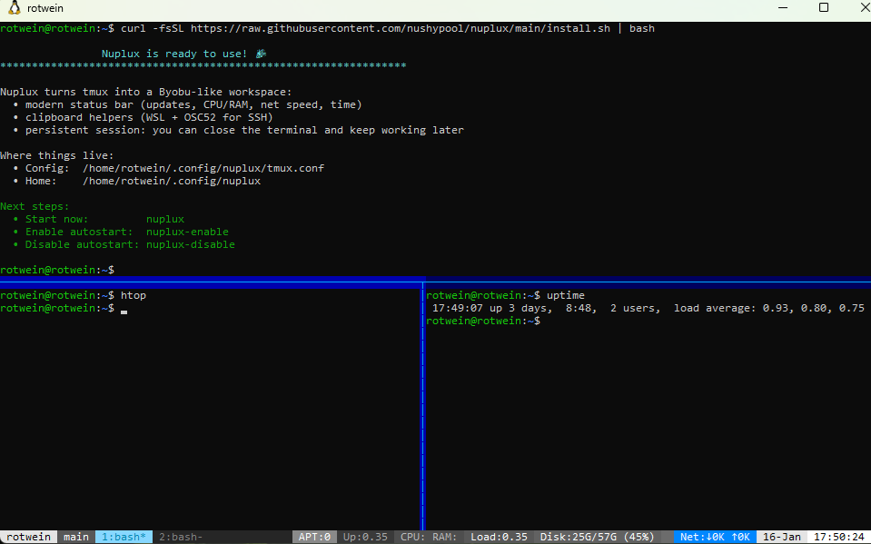

# Nuplux

**Nushy Pool Tmux: one-command Byobu-like tmux setup with status widgets and clipboard helpers.**

Nuplux installs a tmux configuration that feels like Byobu: familiar keybindings, modern status bar, persistent sessions, and sane clipboard behavior (WSL + SSH).



## Install (one command)

```bash
curl -fsSL https://raw.githubusercontent.com/nushypool/nuplux/main/install.sh | bash
```

Optional: verbose installer logs

```bash
curl -fsSL https://raw.githubusercontent.com/nushypool/nuplux/main/install.sh | QUIET=0 bash
```

---

## Where it installs things

Everything lives here (no `~/.tmux.conf`, no `~/.tmux/`):

- `~/.config/nuplux/`
  - `tmux.conf`
  - `scripts/` (status + clipboard helpers)
  - `plugins/` (TPM)
- `~/.local/bin/`
  - `nuplux`
  - `nuplux-enable`
  - `nuplux-disable`

---

## Usage

### Start Nuplux (manual)

```bash
nuplux
```

This attaches to (or creates) the persistent tmux session named `main` using Nuplux config.

### Enable autostart (Byobu-like)

```bash
nuplux-enable
```

From the next terminal login/open, Nuplux auto-attaches to the persistent session.

### Disable autostart

```bash
nuplux-disable
```

### Reload config (when already inside tmux)

```bash
tmux source-file ~/.config/nuplux/tmux.conf
```

---

## Plugins (TPM)

TPM is installed under `~/.config/nuplux/plugins/tpm`.

Inside tmux:

- Install plugins: `Ctrl+b` then `I`
- Update plugins:  `Ctrl+b` then `U`
- Remove plugins:  `Ctrl+b` then `Alt+u`

If `Ctrl+b` + `I` doesn’t work, check that the config includes:
`run "~/.config/nuplux/plugins/tpm/tpm"`

---

## Clipboard notes

- **WSL local**: right-click and `Ctrl+V` paste from Windows clipboard (UTF-8 safe, Cyrillic OK).
- **Remote SSH**: tmux mouse is disabled to avoid fighting your terminal client; use your terminal’s paste (Windows Terminal / iTerm / etc).

Remote → local copy uses OSC52 when the client supports it.

---

## Keyboard bindings (Byobu-ish)

### Windows (tabs)
- `F2`  — New window
- `F3`  — Previous window
- `F4`  — Next window
- `F8`  — Rename window
- `F6`  — Detach (leave session running)

### Splits (panes)
- `Shift+F2` — Split horizontally
- `Ctrl+F2`  — Split vertically
- `Shift+F3` — Focus previous pane
- `Shift+F4` — Focus next pane
- `Ctrl+F6`  — Kill current pane
- `Shift+F5` — Kill all other panes (join back to one)

### Move & resize panes
- `Shift+Arrow` — Move focus between panes
- `Shift+Alt+Arrow` — Resize pane (small steps)

### Copy / scrollback
- `F7` — Enter copy/scroll mode
- `Alt+PgUp`   — Enter copy mode + page up
- `Alt+PgDn`   — Enter copy mode + page down
- `Alt+Up`     — Enter copy mode + scroll up 1 line
- `Alt+Down`   — Enter copy mode + scroll down 1 line

Copy mode (vi):
- `v` — begin selection
- `y` / `Enter` — copy selection to clipboard and exit copy mode
- `Ctrl+C` — copy selection (copy-mode only)

### Misc
- `F5` — Reload Nuplux tmux config
- `F12` — Lock tmux

---

## Uninstall

1) Remove the managed block from `~/.bashrc` (between):
- `# >>> nuplux autostart >>>`
- `# <<< nuplux autostart <<<`

2) Remove:
- `~/.config/nuplux/`
- `~/.local/bin/nuplux*`
- `~/.cache/nuplux/`
